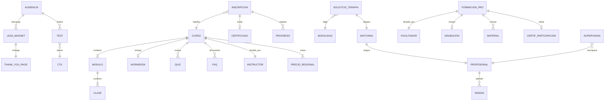

# Modelo de dominio — psimammoliti.com

> Relevamiento por scraping del sitio público `https://www.psimammoliti.com`.
> Fecha del relevamiento: **2026-07-30**. Fuente: `sitemap.xml` (727 URLs) + descarga y
> parseo de 25 páginas representativas. Datos crudos en [`data/`](./data).
>
> **Alcance**: sólo contenido público. No se accedió al área privada de alumnos ni a
> ninguna API autenticada. El sitio es un **Webflow** (CMS de colecciones), no una SPA:
> todo el contenido viene renderizado en el HTML.

---

## 1. Qué es el producto

Psi Mammoliti es una **clínica de psicología online + editorial de contenido** construida
alrededor de la marca personal de Marina Mammoliti (podcast *Psicología al desnudo*).
Opera cuatro líneas de negocio sobre una misma base de audiencia:

| Línea | Monetización | Volumen relevado |
|---|---|---|
| Terapia online (individual, pareja, familia) | Sesión / paquete | ~180 profesionales en `/equipo/` |
| Formación al consumidor (cursos online) | Pago único USD 40–50 | 8 cursos |
| Formación profesional (`Entre Psicos`) | Masterclass USD 49–59 + supervisión USD 60–95 | 3 páginas + talleres |
| Contenido gratuito (lead magnets) | Captura de email | ~432 URLs bajo `/recursos/` |

El embudo es explícito y unidireccional: **contenido gratuito → email → curso → terapia**.
Los tests y descargables no son el producto, son el anzuelo.

---

## 2. Mapa de URLs (colecciones del CMS)

Conteo por prefijo sobre las 727 URLs del sitemap:

| Prefijo | URLs | Colección que representa |
|---|---:|---|
| `/recursos/blog/*` | ~310 | Artículos SEO |
| `/equipo/*` | 180 | Ficha de profesional |
| `/tp/*` | 94 | *Thank-you pages* — una por lead magnet |
| `/recursos/descargables/*` | 62 | PDF / worksheet descargable |
| `/recursos/ebooks/*` | 20 | E-book |
| `/recursos/tests/*` | 17 | Test autoadministrado |
| `/recursos/curso-online/*` | 8 | **Curso** |
| `/servicios/*`, `/terapias/*`, `/solicitar/*` | 9 | Servicios y formularios de alta |
| `/entrepsicos/*` | 3 | Vertical profesional |
| `/membresia`, `/club/*` | 2 | Membresía (en construcción, waitlist) |

Observación estructural: **cada lead magnet tiene dos URLs** — la página de captura
(`/recursos/descargables/{slug}`) y la página de entrega (`/tp/{slug}`). El par
`descargable ↔ tp` es 1:1 y es la unidad de medición del embudo.

---

## 3. Entidades inferidas

### 3.1 Curso (`/recursos/curso-online/{slug}`)

Campos observados en las 8 fichas:

```
Curso
├─ slug, titulo, subtitulo (promesa de transformación)
├─ badges[]        : "Nuevo curso" | "Descuento activo" | "¡TALLER EN VIVO!"
├─ modalidad[]     : "On-demand" | "En vivo"
├─ duracion_horas  : 2 | 3
├─ cantidad_clases : 11 … 21
├─ instructor      : nombre + título profesional + bio + cita
├─ clase_gratuita  : { titulo, gate: email } ── muestra gratis con captura de email
├─ precio[]        : por región (LATAM / Europa / Oceanía-Asia-África / EEUU-Canadá)
│                    lista USD 40–50, promo USD 20–25, Europa €38–48
├─ incluye[]       : workbook, comunidad, acceso ilimitado, certificado, bonus track
├─ modulos[]       : Modulo { titulo, subtitulo, lecciones[] }
│                    └─ Leccion { orden, titulo }   ── "Clase 7: Apego desorganizado"
├─ workbook        : PDF de actividades
├─ faq[]           : { pregunta, respuesta }
└─ relacionados[]  : 3 cursos sugeridos
```

Datos concretos extraídos (ver [`data/cursos.json`](./data/cursos.json)):

| Curso | Clases | Duración | Precio lista | Promo |
|---|---:|---|---|---|
| Apego: la ciencia detrás de tus relaciones | 19 | 2 h | USD 50 / €48 | USD 25 |
| El arte de soltar | 21 | 2 h | USD 50 / €48 | USD 25 |
| La ciencia del descanso | 17 | 3 h | USD 40 / €38 | USD 20 |
| Domina tus hábitos | 16 | 2 h | USD 40 / €39 | USD 20 |
| Reprograma tus creencias limitantes | 15 | 2 h | USD 50 / €48 | USD 25 |
| Tu poder interior (gestión emocional) | 15 | 2 h | USD 50 / €48 | USD 25 |
| Desenrédate (dependencia emocional) | 14 | 3 h | USD 50 / €48 | USD 25 |
| Autocuidado | 11 | 3 h | USD 40 / €38 | USD 20 |

> Nota de parseo: el template de Webflow renderiza **7 slots de módulo fijos** en todas
> las fichas; los que no tienen contenido quedan vacíos. El número real de módulos por
> curso es 4–6. No confundir el artefacto del template con el modelo.

**Modelo pedagógico declarado**: `Aprende → Practica → Aplica`. Clases de 3–10 minutos
("aprende a tu ritmo con clases de 5 minutos"), refuerzo con tres dispositivos distintos:
quizzes al final de cada módulo, actividades prácticas en clase, y mini-tests de reflexión.

**Reglas de negocio declaradas en el FAQ**:
- Acceso inmediato tras el pago (Stripe), entregado por email.
- Ventana de acceso: **6 meses** — pese a que la tarjeta de precio dice "acceso ilimitado"
  (contradicción real del sitio, no error de scraping).
- Sin reembolsos (acceso instantáneo).
- Progreso visible: "qué lecciones y qué porcentaje del curso has completado".
- Certificado de finalización al completar.
- 100% asincrónico, cualquier dispositivo con navegador.

### 3.2 Test (`/recursos/tests/{slug}`)

17 tests: apego, dependencia emocional, lenguajes del amor, autoestima, ansiedad,
ansiedad social, agorafobia, fobias, burnout, heridas de la infancia, depresión post
parto, codependencia, FoMO, inteligencia emocional, lenguajes del perdón, adicción a las
compras, psicología general.

```
Test
├─ slug, titulo (formato SEO: "Test de X Gratis: ¿pregunta gancho?")
├─ preguntas[]  : ítems con opciones tipo Likert
├─ scoring      : client-side, resultado inmediato
├─ resultado    : { categoria, descripcion, recomendaciones[] }
└─ cta_salida   : contenido relacionado o agendar con un profesional
```

Propiedades: sin registro, sin pago, 2–5 minutos, resultado instantáneo. Descargo legal
explícito y repetido: *"no reemplazan una evaluación profesional"*, *"no constituyen
diagnóstico clínico"*.

### 3.3 Profesional (`/equipo/{slug}`)

```
Profesional
├─ slug              : nombre + inicial de apellido ("agustina-d") ── apellido nunca completo
├─ nombre_publico, titulo ("Lic. en Psicología"), universidad
├─ foto, titular, bio
└─ estado            : "Profesional asignado"
```

Deliberadamente minimalista: **no hay agenda pública, ni precio, ni contacto directo, ni
listado navegable del equipo**. Las 180 fichas existen sólo como destino del *matching* —
se le muestran al usuario después de completar el formulario. El apellido se reduce a una
inicial (decisión de privacidad del profesional).

### 3.4 Solicitud de terapia (`/solicitar/{modalidad}`)

Flujo declarado en la home, en 3 pasos:

```
1. Formulario breve: situación, preferencias, disponibilidad, región
2. La plataforma asigna y presenta un profesional  → /equipo/{slug}
3. Se agenda y comienzan las sesiones
```

El *matching* es el corazón del producto de terapia y es opaco desde fuera (no se puede
elegir profesional navegando; te lo asignan).

### 3.5 Lead magnet (`/recursos/descargables/{slug}` + `/tp/{slug}`)

62 descargables. Taxonomía observada por el propio naming de los slugs:

| Tipo | Patrón de slug | Ejemplos |
|---|---|---|
| Reto multi-día | `reto-de-{7,10}-dias-para-*` | 17 retos de 7 y 10 días |
| Ejercicio | `ejercicio-*` | 12 |
| Hoja de trabajo | `hoja-practica-*`, `hoja-reflexiva-*` | 8 |
| Plantilla visual | `plantilla-visual-*` | 3 |
| Test descargable | `test-*` | 11 |
| Otros | juegos, packs, calendarios, kits | ~11 |

El **reto de N días** es el formato más repetido del catálogo: contenido secuenciado por
día, con una acción por jornada. Es un LMS en miniatura empaquetado como PDF.

### 3.6 Vertical profesional (`/entrepsicos`)

Producto B2P (business-to-professional) dirigido a psicólogos y estudiantes avanzados.
Es el vertical **más cercano a lo que construimos nosotros**:

```
Entre Psicos
├─ Formación (masterclass / taller en vivo)
│   ├─ fecha_hora + husos horarios múltiples (ARG / CDMX / BOG)
│   ├─ facilitador externo (ej. abogado, no psicólogo)
│   ├─ temario[]  ── lista de puntos, no módulos
│   ├─ "qué te vas a llevar"[] : entregables concretos (modelo de consentimiento,
│   │                             protocolo, guía de buenas prácticas)
│   ├─ grabacion  : incluida, disponible 30 días
│   ├─ material_descargable
│   ├─ certificado_de_participacion
│   └─ precio     : USD 59 → USD 49 (15% OFF por tiempo limitado)
├─ Supervisión clínica : grupal, USD 60–95 según región
├─ Comunidad ("El Cafecito") : gratuita, encuentros de conversación horizontal
└─ Newsletter profesional
```

Reglas declaradas: suscripción cancelable en cualquier momento, y **acceso retroactivo al
material y grabaciones de meses anteriores**.

### 3.7 Membresía (`/membresia`) — en construcción

Waitlist con captura de `email + país`. Promete unificar contenido exclusivo, comunidad,
experiencias en vivo y terapia en un solo lugar. Es la dirección declarada del producto:
de catálogo suelto a **suscripción con comunidad**.

---

## 4. Diagrama del modelo



---

## 5. Decisiones de producto que vale la pena registrar

1. **Lección corta como unidad atómica.** 3–10 minutos. Un curso de "2 horas" son 19
   clases, no 2 videos de una hora. La granularidad es la que permite el progreso visible
   y la sensación de avance.
2. **Muestra gratis con gate de email**, no curso gratis. Se libera *una* clase, la que
   plantea el problema (Módulo 1), nunca la que lo resuelve.
3. **Precio regional con selector explícito** (LATAM / Europa / Oceanía-Asia-África /
   EEUU-Canadá). Reconoce el poder adquisitivo del mercado hispanoamericano.
4. **Tres dispositivos de refuerzo distintos** por curso: quiz de módulo (evaluación),
   actividad en clase (aplicación), mini-test (reflexión). No son lo mismo y no se
   mezclan.
5. **El certificado se enmarca como logro personal**, no como credencial. Baja la promesa
   y evita el problema de acreditación.
6. **Descargo legal repetido** en cada test y en el FAQ. Sistemático, no decorativo.
7. **Ventana de acceso acotada** (6 meses) que genera urgencia sin cortar el acceso el día
   uno.
8. **El apellido del profesional se oculta.** Privacidad del terapeuta como default.
9. **La grabación de lo "en vivo" es un activo reutilizable**: se vende en vivo, se
   entrega grabada 30 días, y se archiva para acceso retroactivo de los suscriptores.

---

## 6. Reproducir el relevamiento

```bash
curl -s https://www.psimammoliti.com/sitemap.xml \
  | grep -o '<loc>[^<]*</loc>' | sed 's|</\?loc>||g' | sort > sitemap-urls.txt
```

Las páginas se descargaron con `curl -sL` y user-agent de navegador; el HTML de Webflow
trae todo el contenido del CMS renderizado, sin necesidad de ejecutar JavaScript.
El parseo de las fichas de curso está en `data/cursos.json`.
